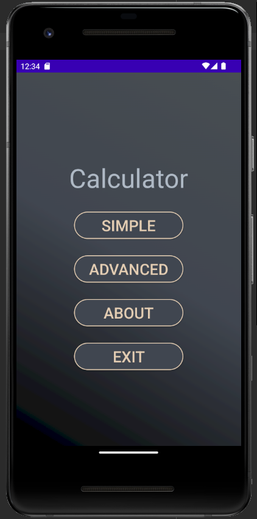
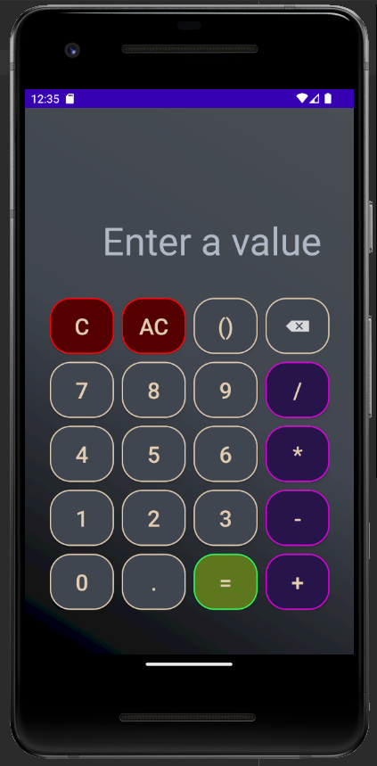
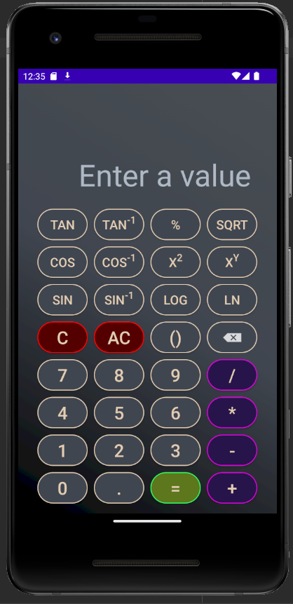
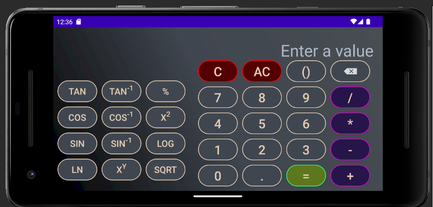
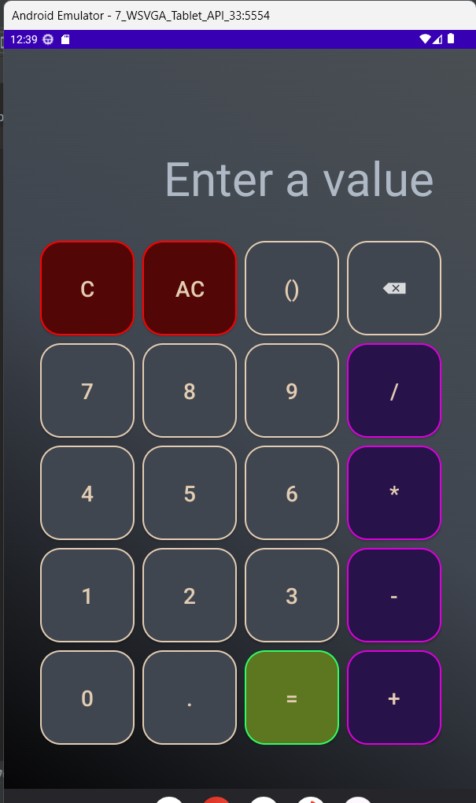
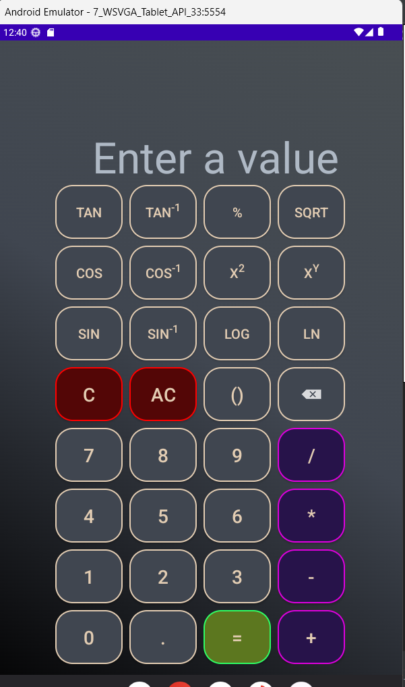

# kotlin-calculator-app
Calculator app created in Android Studio implemented in Kotlin

## Phone view

Menu

Simple calculator

Advanced calculator

Advanced horizontal calculator

## Tablet view

Simple calculator

Advanced calculator

## Credits

This project uses exp4j (https://github.com/fasseg/exp4j) to evaluate mathematical expressions.